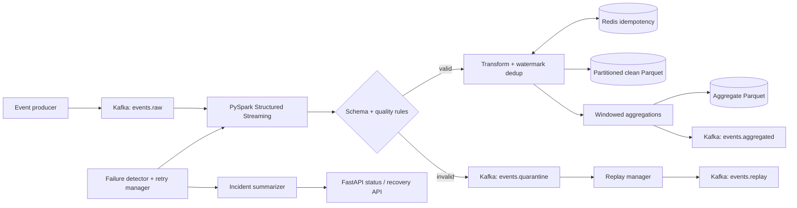

# Self-Healing Streaming Data Pipeline

A production-style reference pipeline that ingests events from Kafka, validates and quarantines malformed payloads, transforms and deduplicates valid records, computes near-real-time PySpark aggregations, and persists analytics-ready Parquet datasets. Redis supplies cross-restart idempotency, while checkpoints, bounded retries, quarantine replay, failure detection, and structured incident summaries provide the self-healing layer.

## Why this project

Streaming systems fail in partial and inconvenient ways: brokers become unavailable, a checkpoint is damaged, a downstream write times out, or a producer changes its payload. This project demonstrates how a data platform can keep bad data isolated, retry transient failures safely, recover state, and leave an operator with useful evidence instead of an opaque stack trace.

## Technology

Python 3.11, Apache Kafka, PySpark Structured Streaming, Redis, Parquet, FastAPI, Pydantic, Tenacity, Docker Compose, Kubernetes, pytest, and GitHub Actions.

## Architecture



The full diagrams and design rationale are in [`docs/architecture.md`](docs/architecture.md) and [`diagrams/system_architecture.md`](diagrams/system_architecture.md).

## Repository map

```text
src/
  producer/       synthetic events and Kafka producer
  streaming/      Spark session, validation, transforms, dedup, aggregation, writers
  recovery/       detection, retry, replay, idempotency, recovery actions
  incident_ai/    incident collection, mock/optional OpenAI summary, recommendations
  api/            status, metrics, incidents, quarantine, replay and retry endpoints
configs/          pipeline, topics, quality and retry policies
schemas/          event, quarantine and aggregation JSON Schemas
deployments/      Docker image and Kubernetes manifests
scripts/          topic creation, startup, failure simulation and replay
tests/            deterministic unit/API tests
docs/             implementation and deployment notes
diagrams/         Mermaid system and recovery flows
```

## Kafka topics

| Topic | Purpose |
|---|---|
| `events.raw` | Producer input and normal replay destination |
| `events.validated` | Optional validated-event integration point |
| `events.transformed` | Clean transformed event stream |
| `events.aggregated` | Windowed metrics encoded as JSON |
| `events.quarantine` | Invalid payload plus structured validation context |
| `events.dead_letter` | Records that exhausted replay attempts |
| `events.replay` | Auditable replay hand-off |

See [`docs/kafka_design.md`](docs/kafka_design.md).

## Streaming design

The pipeline reads Kafka values as strings, retains the original payload, parses against an explicit Spark schema, and applies column-based quality rules. Invalid rows are written to quarantine. Valid rows receive normalized timestamps, an `event_date`, a deterministic processing key, and watermark-based duplicate removal. A Redis-backed `foreachBatch` gate prevents already-written event IDs from being persisted again after restarts. Clean data is partitioned by `event_date/region`.

A second stateful Structured Streaming query uses five-minute event-time windows and emits event counts, average values, error counts, and approximate unique-device counts. Aggregate Parquet is partitioned by `window_date/event_type`. Every sink has an independent checkpoint.

## Validation, quarantine, and replay

Rules are defined in [`configs/quality_rules.yaml`](configs/quality_rules.yaml): required IDs/timestamps, an allowed event-type and region set, supported payload versions, numeric/non-negative values, required identity and metadata, parseable JSON, and a configurable future-time tolerance. A quarantine envelope stores the original payload, error category/message/field, processing time, replay eligibility, and retry count.

`ReplayManager` revalidates eligible quarantine records, increments retry metadata, publishes repaired records to `events.replay` and `events.raw`, and sends exhausted records to `events.dead_letter`. The API exposes the same operation at `POST /replay/quarantine`.

## Deduplication and recovery

Spark watermarking removes duplicates within event-time state. Redis adds cross-query and cross-restart idempotency with a configurable TTL and lifecycle states (`received`, `validated`, `transformed`, `written`, `quarantined`, `replayed`). If Redis is unavailable, a thread-safe local SQLite store provides a degraded-mode fallback.

The supervisor classifies Kafka, Redis, checkpoint, Spark-query, quarantine-rate, and output failures. Transient operations use bounded exponential backoff. Checkpoint recovery keeps healthy checkpoints, archives a corrupt leaf checkpoint before a clean restart, and records every action. Repeated record failures move to dead letter. Incident metadata is persisted as JSON for the API.

## Quick start (local Python)

Prerequisites: Python 3.11+, Java 17, and local Kafka/Redis (Docker is easiest).

```bash
python -m venv .venv
source .venv/bin/activate            # Windows: .venv\Scripts\activate
pip install -r requirements.txt
cp .env.example .env
pytest -q
python -m src.api.main
python -m src.producer.kafka_producer --count 100 --invalid-rate 0.1
python main.py pipeline
```

Useful Make targets:

```bash
make install
make topics
make produce-events
make run-pipeline
make run-api
make test
```

On Windows without `make`, run the equivalent commands from the `Makefile`.

## Run everything with Docker

```bash
docker compose up --build -d
docker compose --profile tools run --rm producer
curl http://localhost:8000/health
```

The stack contains Kafka (KRaft mode), Redis, a Spark master and worker, the streaming pipeline, and the incident API. A one-shot init service creates every Kafka topic before the pipeline starts. Host outputs are mounted under `data/`; inspect the stream with `docker compose logs -f pipeline`.

## Produce events and simulate failures

```bash
./scripts/produce_events.sh 100 0.10
./scripts/simulate_failure.sh malformed
./scripts/simulate_failure.sh redis
./scripts/replay_quarantine.sh
```

`malformed` publishes deliberately invalid payloads. `redis` pauses the Compose Redis container (run the script again with `restore` to resume it). `checkpoint` places a corruption marker in a disposable checkpoint leaf so the supervisor path can be exercised.

## Incident summaries

The default `AI_PROVIDER=mock` is deterministic and offline: it classifies the observed failure, writes a structured report, and recommends recovery steps. Setting `AI_PROVIDER=openai` and `OPENAI_API_KEY` enables the optional adapter; secrets are never committed. If the remote provider fails or returns invalid data, the summarizer safely falls back to the mock provider.

```bash
curl -X POST http://localhost:8000/incidents/summarize \
  -H "Content-Type: application/json" \
  -d '{"exception_message":"Redis connection refused","redis_status":"down","retry_attempts":3}'
```

Browse API documentation at [http://localhost:8000/docs](http://localhost:8000/docs).

## Kubernetes

The manifests in `deployments/kubernetes/` provide a namespace, ConfigMap, example Secret, Redis service/deployment, external Kafka service reference, pipeline/API deployments, PVC, and API HPA. Replace image names and Kafka endpoints, create a real secret out of band, then run:

```bash
kubectl apply -f deployments/kubernetes/namespace.yaml
kubectl apply -f deployments/kubernetes/configmap.yaml
kubectl apply -f deployments/kubernetes/redis-service.yaml
kubectl apply -f deployments/kubernetes/kafka-service.yaml
kubectl apply -f deployments/kubernetes/pipeline-deployment.yaml
kubectl apply -f deployments/kubernetes/incident-api-deployment.yaml
kubectl apply -f deployments/kubernetes/hpa.yaml
```

See [`docs/deployment_guide.md`](docs/deployment_guide.md) for storage and production Kafka guidance.

## Testing and CI

```bash
pytest -q
python -m compileall -q src
docker compose config --quiet
```

Tests focus on deterministic domain logic and use in-memory/fake publishers rather than requiring Kafka, Spark, or Redis. CI runs Python 3.11, installs dependencies, validates imports, runs tests, and validates the Compose model.

## Resume-ready summary

**Self-Healing Streaming Data Pipeline**  
Personal Project | Python, Apache Kafka, PySpark Structured Streaming, Redis, Parquet, Docker, Kubernetes

- Built a streaming pipeline that validates, transforms, deduplicates, and aggregates events using Kafka and PySpark.
- Enforced schema and quality rules, routing malformed records to quarantine topics with error context and replay support.
- Implemented automated failure detection, checkpoint recovery, exponential retries, and idempotent processing across restarts.
- Added an AI-assisted incident module that summarizes failures and recommends recovery actions from logs and pipeline metadata.

## Limitations and future work

- The included Kafka deployment is a local single broker; production should use a managed or multi-broker cluster with TLS/SASL and replicated topics.
- Redis fallback is per-pipeline-instance SQLite. A production degraded mode should use a shared durable store or pause consumption to guarantee global exactly-once behavior.
- Parquet is intentionally used per the brief; Apache Iceberg/Delta/Hudi would provide stronger transactional table semantics and compaction.
- Kafka JSON Schema validation is local. A production rollout would integrate a registry with compatibility enforcement.
- Kubernetes Spark is deployed in standalone client form for readability. The Spark Operator is preferable for lifecycle management at scale.

Detailed future improvements include OpenTelemetry, Prometheus alerts, schema-registry compatibility checks, transactional Kafka sinks, table compaction, and chaos/integration tests.
