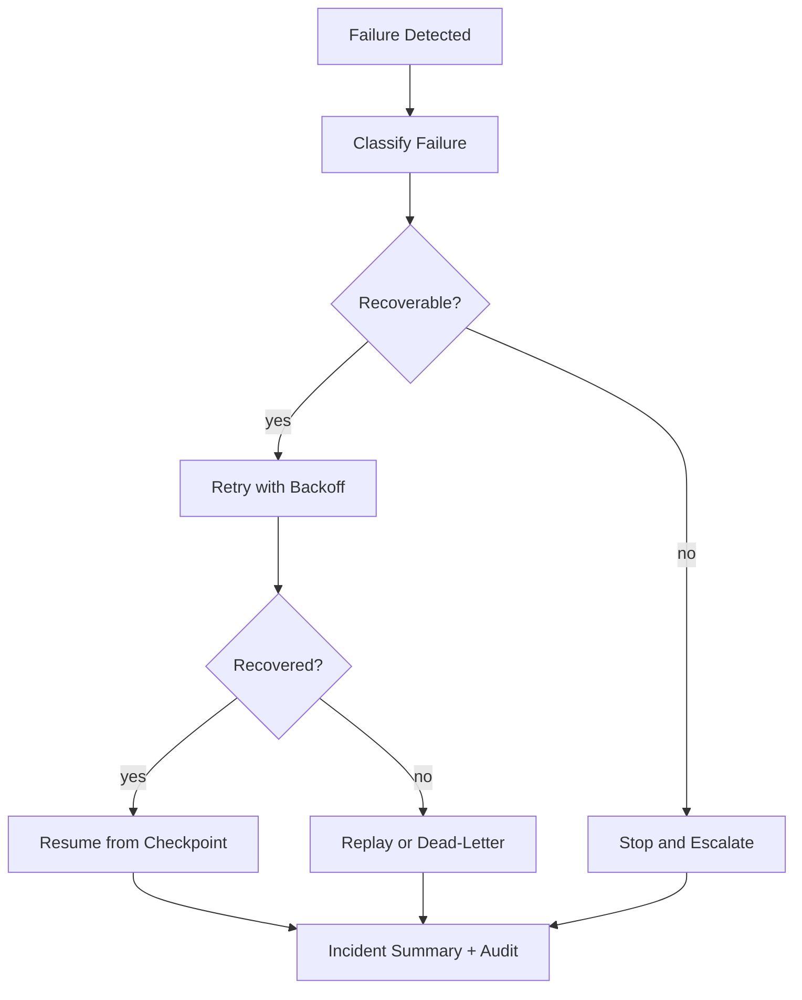

# Failure recovery flow

```mermaid
flowchart TD
    Failure["Failure Detected"] --> Classify["Classify Failure"]
    Classify --> Known{"Recoverable?"}
    Known -->|yes| Retry["Retry with Backoff"]
    Retry --> Recovered{"Recovered?"}
    Recovered -->|yes| Resume["Resume from Checkpoint"]
    Recovered -->|no| Replay["Replay or Dead-Letter"]
    Known -->|no| Stop["Stop and Escalate"]
    Resume --> Incident["Incident Summary + Audit"]
    Replay --> Incident
    Stop --> Incident
```
