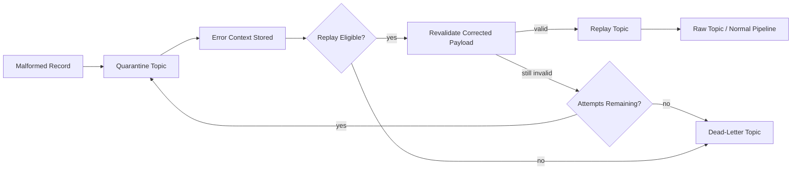

# Quarantine replay flow

```mermaid
flowchart LR
    Bad["Malformed Record"] --> Topic["Quarantine Topic"]
    Topic --> Context["Error Context Stored"]
    Context --> Eligible{"Replay Eligible?"}
    Eligible -->|yes| Validate["Revalidate Corrected Payload"]
    Validate -->|valid| Replay["Replay Topic"]
    Replay --> Raw["Raw Topic / Normal Pipeline"]
    Validate -->|still invalid| Attempts{"Attempts Remaining?"}
    Attempts -->|yes| Topic
    Attempts -->|no| DLQ["Dead-Letter Topic"]
    Eligible -->|no| DLQ
```
