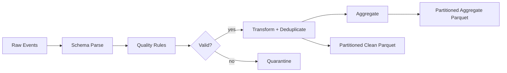

# Streaming flow

```mermaid
flowchart LR
    Raw["Raw Events"] --> Parse["Schema Parse"]
    Parse --> Rules["Quality Rules"]
    Rules --> Split{"Valid?"}
    Split -->|yes| Transform["Transform + Deduplicate"]
    Split -->|no| Q["Quarantine"]
    Transform --> Aggregate["Aggregate"]
    Transform --> Clean["Partitioned Clean Parquet"]
    Aggregate --> Output["Partitioned Aggregate Parquet"]
```
