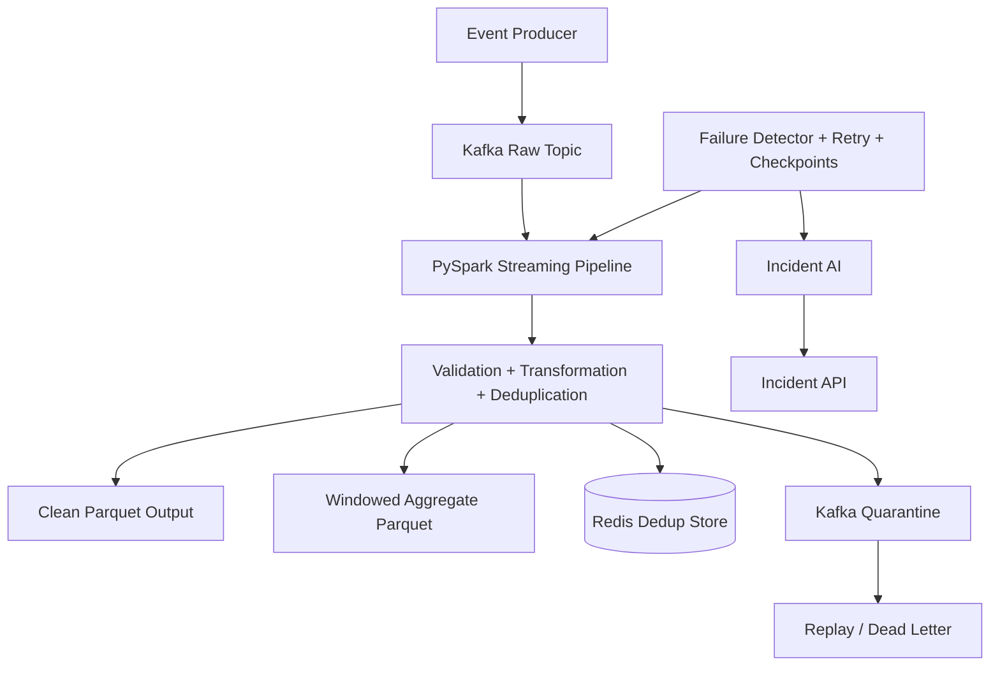

# System architecture

```mermaid
flowchart TB
    Producer["Event Producer"] --> Raw["Kafka Raw Topic"]
    Raw --> Spark["PySpark Streaming Pipeline"]
    Spark --> Core["Validation + Transformation + Deduplication"]
    Core --> Clean["Clean Parquet Output"]
    Core --> Agg["Windowed Aggregate Parquet"]
    Core --> Redis[("Redis Dedup Store")]
    Core --> Quarantine["Kafka Quarantine"]
    Quarantine --> Replay["Replay / Dead Letter"]
    Monitor["Failure Detector + Retry + Checkpoints"] --> Spark
    Monitor --> AI["Incident AI"]
    AI --> API["Incident API"]
```
